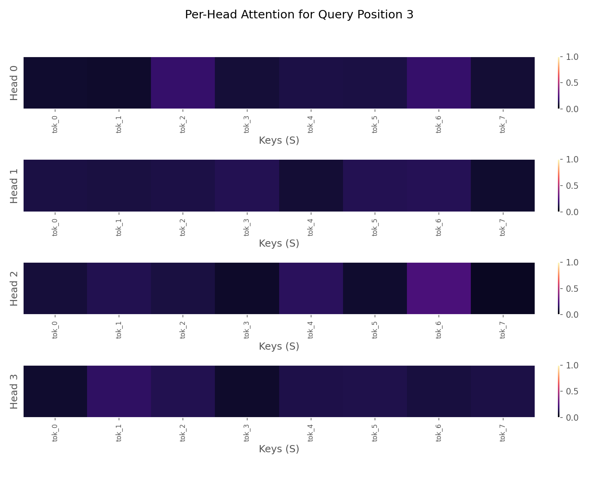
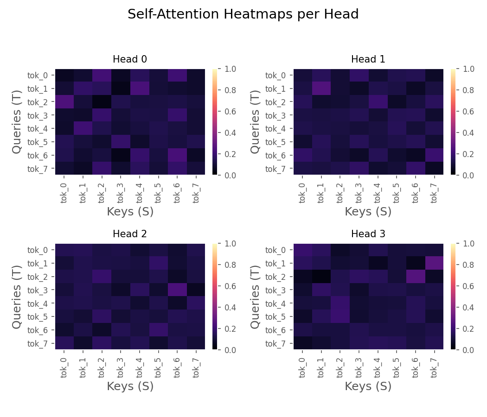
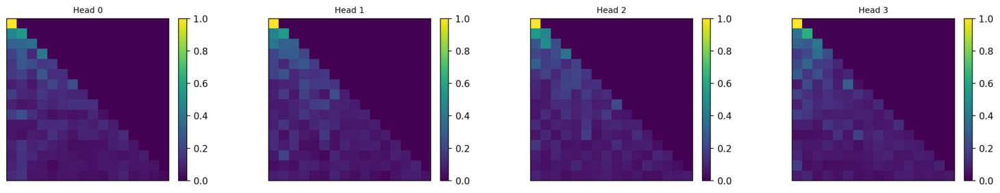
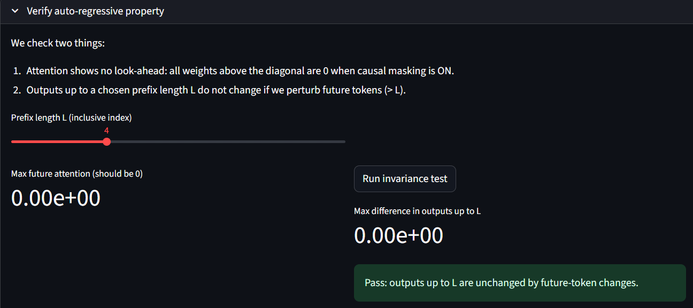

# Multi-Head Attention Playground — Single-token → Multi-head → Causal Masking

This repository contains a small, self-contained exploration of attention mechanisms:
- Implement dot-product attention for a single token
- Scale that to multi-head attention and visualize attention weight heatmaps per head
- Implement causal masking and verify the autoregressive (no-lookahead) property

This README explains the concepts, the code layout, how to run the Streamlit visualization app, how to run the verification script, examples of expected output shapes, and troubleshooting tips

## Table of contents
- Overview
- Concepts & intuition
  - Dot-product attention (single token)
  - Multi-head attention
  - Causal masking and autoregressivity
- Repository files
- How to run
  - Install dependencies
  - Run the Streamlit visualizer
  - Run the verification script
- Usage examples (code snippets)
- Interpreting the visualizations

## Overview

This project builds from first principles:
1. single_token_attention: compute dot-product attention for a single query token against a sequence of keys/values.
2. MultiHeadAttention: scale single-token attention to multi-head attention (batched, multi-head, multi-query).
3. Visualization utilities: produce per-head heatmaps and per-position per-head plots.
4. Causal masks: implement masks to prevent attending to future positions and verify that outputs up to a prefix remain unchanged when future tokens are modified.


# Single Token Attention

## Implementation

The `single_token_attention` function implements the core attention mechanism for one query position at a time. Here's how it works in plain terms:

### What It Does
- Takes one "question" (query) and finds out how much attention to pay to each "answer" (values) based on their "relevance scores" (keys)
- Returns both the weighted sum of values and the attention weights themselves

### How It Works
- Scores Calculation:
    - Computes how much each key matches the query using matrix multiplication
    - Scales scores by 1/sqrt(d_k) to prevent extreme values
- Masking (if provided):
    - Applies a mask to prevent attending to certain positions (like padding or future tokens)
    - Uses a large negative number (-1e9) to make masked positions have near-zero attention
- Attention Weights:
    - Applies softmax to convert scores to probabilities (all positive, sum to 1)
    - Optionally applies dropout for regularization
- Output:
    - Computes a weighted sum of values based on attention weights
    - Returns both the output and attention weights for inspection

### Why It Matters
This single-token attention is the building block for more complex attention mechanisms. In practice, we'll extend this to process all positions simultaneously and add multiple attention heads, but the core idea remains the same: determine how much to "pay attention" to each part of the input when computing each output.

# Multihead Attention

## Implementation

Multihead Attention extends single-token attention by running multiple attention mechanisms in parallel, allowing the model to focus on different aspects of the input simultaneously. Here's a breakdown of our implementation:

### Core Components

1. **Multiple Attention Heads**:
   - Splits the input into `num_heads` different sets of queries, keys, and values
   - Each head learns different attention patterns
   - Implemented in [MultiHeadAttentionViz](cci:2://file:///c:/Users/praty/Desktop/GSoc/Notes%20on%20LM/notes/attention/vizualize_casualM_autoreg/MultiHeadAttnViz.py:6:0-176:21) class
... [will update]

### How It Works
- Input Projection:
    - Each input is projected into query, key, and value spaces
    - These are split across multiple heads
- Scaled Dot-Product Attention:
    - Computes attention scores for each head
    - Applies scaling (1/√dₖ) to prevent gradient issues
    - Optionally applies masking for causal attention
- Concatenation and Projection:
    - Outputs from all heads are concatenated
    - Final linear projection produces the output

### Key Features
- Parallel Processing: Multiple attention heads work simultaneously
- Parameter Efficiency: Shares parameters across sequence positions
- Flexible Masking: Supports both padding and causal masks
- Visualization: Built-in support for attention weight visualization

### Visualization
The implementation includes utilities to visualize attention patterns:

- Heatmaps for each attention head
- Per-head attention weights for specific positions
- Support for both single-head and multi-head visualization

### Why It's Important
Multihead attention is the core of transformer architectures because it:

- Captures different types of relationships in parallel
- Provides more robust representations
- Enables efficient processing of long sequences
- Forms the foundation for models like GPT and BERT


# Causal Masking

## Implementation

Causal masking ensures that during training, each position in the sequence can only attend to previous positions, which is crucial for auto-regressive generation. Here's how it's implemented:

### Core Concept
- Prevents "looking ahead" in the sequence
- Creates a lower triangular mask where positions can only attend to themselves and previous positions
- Implemented in [attention_masks.py](vizualize_casualM_autoreg/attention_masks.py) with [make_causal_mask()](vizualize_casualM_autoreg/attention_masks.py)

- Integration with Attention
   - Applied before softmax in the attention mechanism
   - Sets future positions to -inf (effectively zero after softmax)
   - Preserves the auto-regressive property during generation

### How It Works

1. **Mask Generation**:
   - Creates a lower triangular matrix of ones
   - Expands to match batch size and number of heads
   - Example for sequence length 3:
     ```
     [[1, 0, 0],
      [1, 1, 0],
      [1, 1, 1]]
     ```

2. **Application**:
   ```python
   # In forward pass:
   if mask is not None:
       mask_b = _prepare_mask(mask, batch_size, self.num_heads, seq_len, key_seq_len, 
                            scores.device, scores.dtype)
       scores = scores.masked_fill(~mask_b, float('-inf'))
   ```

### Key Features

- **Efficient**: Computed once and reused across attention heads
- **Flexible**: Handles different sequence lengths and batch sizes
- **Numerically Stable**: Uses -inf for masking to work well with softmax

### Visualization

The implementation includes visualization of:
- Causal mask patterns
- Attention weights with and without masking
- Verification of the auto-regressive property

### Why It's Important

Causal masking is essential for:
1. Auto-regressive generation (e.g., in GPT models)
2. Preventing information leakage from future tokens
3. Maintaining the auto-regressive property during training
4. Enabling efficient sequence generation


# Auto-regressive Property in Attention Mechanisms

## Core Concept
Auto-regressive models generate sequences one element at a time, where each new element depends only on previously generated elements. In attention mechanisms, this is enforced through **causal masking**, which prevents the model from "peeking" at future tokens when making predictions.

## How It Works

### 1. Causal Masking
A lower triangular matrix is used to mask future positions, ensuring each position can only attend to itself and previous positions:

```python
# Example for sequence length 3
[
    [1, 0, 0],  # First token can only see itself
    [1, 1, 0],  # Second token can see first and itself
    [1, 1, 1]   # Last token can see all previous tokens and itself
]
```

### 2. Implementation in Code

#### a) Creating the Causal Mask
```python
def make_causal_mask(T, S=None, device="cpu", dtype=torch.float32):
    if S is None:
        S = T
    # Create lower triangular matrix
    mask = torch.tril(torch.ones((T, S), dtype=dtype, device=device))
    return mask
```

#### b) Applying the Mask in Attention
```python
# In the attention calculation:
scores = torch.matmul(Q, K.transpose(-2, -1)) / math.sqrt(d_k)

# Apply causal mask (1 = keep, 0 = mask)
scores = scores.masked_fill(mask == 0, float('-inf'))

# Softmax makes masked positions effectively zero
attn_weights = F.softmax(scores, dim=-1)
```

### 3. Verifying the Property

#### a) No Look-Ahead Check
```python
def verify_no_lookahead(attn_weights):
    # Check that attention weights above diagonal are zero
    T = attn_weights.size(-2)
    future_mask = torch.triu(torch.ones_like(attn_weights, dtype=torch.bool), diagonal=1)
    max_future = attn_weights[future_mask].max().item()
    return max_future < 1e-6  # Should be effectively zero
```

#### b) Output Invariance Test
```python
def test_output_invariance(model, x, mask):
    # Original output
    out1 = model(x, x, x, mask=mask)
    
    # Perturb future tokens
    x_perturbed = x.clone()
    x_perturbed[:, 5:, :] = torch.randn_like(x_perturbed[:, 5:, :])
    
    # Output should be the same up to the perturbation point
    out2 = model(x_perturbed, x_perturbed, x_perturbed, mask=mask)
    return torch.allclose(out1[:, :5], out2[:, :5])  # First 5 positions should match
```

## Why It Matters

1. **Auto-regressive Generation**: Enables models to generate sequences one token at a time
2. **Temporal Dependence**: Ensures predictions depend only on past and present, not future
3. **Training Stability**: Prevents information leakage during training
4. **Real-world Applicability**: Matches how we process sequences in real time

This property is fundamental to how transformer models like GPT generate coherent, sequential outputs.

## How to Run

### Install Dependencies

```bash
# Create and activate a virtual environment (recommended)
python -m venv venv
source venv/bin/activate  # On Windows: venv\Scripts\activate

# Install required packages
pip install -r requirements.txt
```

### run streamlit vizualizer for casual masking
```bash
# Navigate to the visualization directory
cd notes/attention/vizualize_casualM_autoreg

# Run the Streamlit app
streamlit run app.py
```
### run verification script
```bash
# Navigate to the visualization directory
cd notes/attention/vizualize_casualM_autoreg

# Run the verification script
python verify_causal_mask.py
```

### run streamlit vizualizer for multihead attention
```bash
# Navigate to the visualization directory
cd notes/attention/vizualize_multihead_attn

# Run the Streamlit app
streamlit run app.py
```

## Interpreting the visualizations
### Attention Positions plots from [vizualize_multihead_attn/attn_viz.py](vizualize_multihead_attn/attn_viz.py)


### ## The Big Idea

You're seeing what one specific word (or token) in a sentence is "looking at" or "paying attention to."

Imagine the model is processing the sentence: `tok_0 tok_1 tok_2 tok_3 tok_4 tok_5 tok_6 tok_7`. This plot shows what happens when the model tries to understand the token at **Position 3** (the "query" `tok_3`).

---

### ## Deconstructing the Plot

1.  **"Query Position 3"**: This is our "observer" token, `tok_3`. It's the one "asking the question," and it needs to gather information from the other tokens to understand its own context.

2.  **"Keys (S)" (X-Axis)**: These are all the tokens in the sequence (`tok_0` to `tok_7`) that our query token (`tok_3`) can "look at." The query token compares itself to each of these "key" tokens.

3.  **"Per-Head" (Y-Axis)**: This is **Multi-Head Attention**. The model doesn't just "look" at the sequence once. It has multiple "heads" (in this case, 4 heads) that learn to look for different things simultaneously.
    * One head might learn to look at the previous word.
    * Another head might learn to look at verbs in the sentence.
    * Another might learn to look at punctuation.

4.  **The Colors (Attention Weights)**: The color of each square shows how much "attention" the query token (`tok_3`) is paying to that key token.
    * **Dark Purple (Value ≈ 0.0)**: No attention. `tok_3` is ignoring this key token.
    * **Bright Pink (Value ≈ 1.0)**: High attention. `tok_3` finds this key token very important.

---

### ## What This Image Tells Us

You can see that each head has learned a different attention pattern for `tok_3`:

* **Head 0**: Pays moderate attention to `tok_2` and `tok_6`.
* **Head 1**: Pays moderate attention to `tok_2` and a lot of attention to `tok_6` and `tok_7`.
* **Head 2**: Mostly ignores everything *except* `tok_5` and `tok_6`, which it finds very important.
* **Head 3**: Spreads its attention out, looking at `tok_1`, `tok_2`, and `tok_6`.

**In short: This plot shows that when the model is processing `tok_3`, it combines different "perspectives" (the heads). All heads seem to agree that `tok_6` is important, but they also bring in information from other tokens like `tok_2`, `tok_5`, and `tok_7` to build a complete picture.**

### Attention Heads plot from [vizualize_multihead_attn/attn_viz.py](vizualize_multihead_attn/attn_viz.py)


Think of it as a map showing *every* token's focus on *every other* token.

---
## ## How to Read the Plots

* **X-Axis (Keys):** These are the tokens in the sequence that are "being looked at."
* **Y-Axis (Queries):** These are the tokens in the sequence that are "doing the looking."
* **Color (Attention Weight):** The brightness of the square shows the strength of attention.
    * **Dark Purple (≈ 0.0):** No attention.
    * **Bright Orange/Yellow (≈ 1.0):** High attention.

Each square at `(row, column)` or `(Query, Key)` answers the question: **"How much attention does the token on the Y-axis pay to the token on the X-axis?"**

For example, in **Head 2**, the square at `(Query: tok_3, Key: tok_7)` is very bright, meaning `tok_3` pays a lot of attention to `tok_7`.

---
## ## What This Image Reveals

This visualization perfectly illustrates why it's called **Multi-Head** Attention. Each head learns a different, specialized attention pattern:

1.  **Head 0:** This head seems to have a **locality bias**. Most tokens pay strong attention to themselves (the bright diagonal) and the token immediately preceding them (the diagonal just below the main one). For example, `tok_4` strongly attends to `tok_3`.

2.  **Head 1:** This head is similar to Head 0 but with a slightly stronger focus on the token *two steps* back (e.g., `tok_7` attends to `tok_5`).

3.  **Head 2:** This head has learned a more complex, non-local pattern. It's not just looking at nearby tokens. For instance, `tok_3` strongly attends to `tok_7`, and `tok_7` attends to `tok_6`.

4.  **Head 3:** This head shows another unique pattern. `tok_2` seems to be a "gatherer" token, paying high attention to `tok_7`. Meanwhile, other tokens like `tok_5` and `tok_6` seem to be paying attention to "themselves" or nearby tokens.



### ## Understanding the "Causal Mask" in Self-Attention Heatmaps

**What you're seeing here are self-attention heatmaps, very similar to the last image, but with one critical difference: the triangular pattern.** This pattern isn't arbitrary; it's a direct result of something called a **causal mask** (or **look-ahead mask**).

#### **What is a Causal Mask?**

In many language models, especially those designed for text generation (like auto-regressive models), a token at a given position `i` is only allowed to "look at" or attend to tokens at positions `j` where `j <= i`. In simpler terms: **a token can only see itself and the tokens that came *before* it in the sequence; it cannot see into the future.**

#### **Why is it "Causal"?**

Because it enforces a causal relationship: the output at position `i` can only be influenced by inputs up to and including position `i`. This is essential for tasks like:

* **Text Generation:** When generating the next word, the model shouldn't peek at the actual next word to be generated. It must predict it based only on what it has seen so far.
* **Language Modeling:** Similarly, when calculating the probability of a word given its preceding context, future words are unknown.

#### **Interpreting the Triangular Pattern in Your Image:**

Take a close look at any of the heatmaps:

* **Dark Regions (usually near the top-right triangle):** These represent the masked-out parts. If a square `(Query_i, Key_j)` is dark, it means token `i` (on the Y-axis) is **forbidden** from attending to token `j` (on the X-axis) because `j > i` (token `j` is in the future relative to token `i`). The attention weight for these cells is effectively zero (or a very tiny number after softmax, because we usually fill them with `-inf` before softmax).
* **Visible Regions (the lower-left triangle, including the diagonal):** These are the allowed attention pathways. Here, token `i` can attend to token `j` where `j <= i`.
    * **The Diagonal:** Always bright, as every token pays strong attention to itself (which is allowed).

#### **What Each Head is Doing (with the Causal Constraint):**

Even with the causal mask, each head still learns a distinct strategy for *how* to attend to the *past* tokens:

* **Head 0:** Shows very strong attention to itself (the diagonal) and some attention to immediate preceding tokens, but also seems to have some broader, less distinct attention to earlier tokens as well. The very first token (`tok_0`) can only attend to itself, so it's always fully lit up.
* **Head 1:** Similar patterns, but perhaps with slight variations in how much emphasis is placed on the immediately preceding token versus slightly older tokens.
* **Head 2:** Appears to put more weight on a few specific earlier tokens compared to other heads, even within the causal window.
* **Head 3:** Another distinct pattern, potentially prioritizing a different set of past tokens.




#### **What is this "Auto-Regressive Property"?**

It's a simple, non-negotiable rule for a generative model: **The output for any token *L* must *only* depend on the input tokens from position 0 up to *L*.**

It cannot, under any circumstances, be influenced by *any* information from tokens *L+1*, *L+2*, etc. If it were, it would be "cheating" by looking into the future it's supposed to be predicting.

#### **The Experiment: How We Prove It**

This "invariance test" is a clever experiment to confirm this property holds. Here's how it works:

1.  **Choose a "Prefix" (L):** We use the slider to pick a position, `L`. In the image, we've chosen `L = 4`.
2.  **Run 1 (Get the "Original"):** We feed our model a sequence and record the output vectors for all tokens from 0 up to `L` (i.e., tokens 0, 1, 2, 3, and 4).
3.  **"Perturb" the Future:** We take the *same input sequence* but this time we "perturb" it—we randomly change all the tokens *after* position `L`. So, token 5, 6, 7, etc., are now different.
4.  **Run 2 (Get the "New"):** We feed this new, perturbed sequence into our model.
5.  **The Moment of Truth:** We compare the output vectors from Run 1 (positions 0-4) with the output vectors from Run 2 (positions 0-4).

#### **Interpreting the Results**

As you can see in the image:

* **Max future attention (should be 0):** This is our visual check, confirming the mask is on. The value is `0.00e+00`. Pass.
* **Max difference in outputs up to L:** This is our functional check. The value is `0.00e+00`. This means the difference between the "original" outputs and the "new" outputs is **zero**.

The "Pass" message confirms it: **Changing the future had absolutely no effect on the past's calculations.**

This is how we *prove* our model is truly auto-regressive and that our causal mask isn't just a pretty visual but a core, functional part of our architecture. Excellent work.

