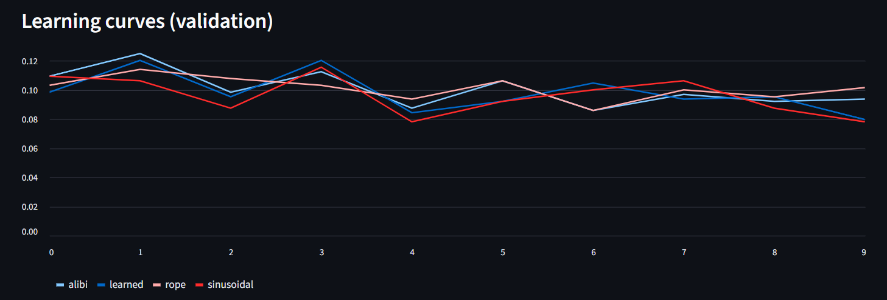

# Run instructions
1. install the requirements.txt
    i. if you have gpu then make sure installing torch with gpu support with appropriate cuda version
```bash
pip install -r requirements.txt
```
2. run the app.py ( from notes/possitional_emb/app folder)
```bash
streamlit run app.py
```
3. now compare the results

# Modular Sum Task
background: It is a synthetic benchmark used to test how well different positional encoding methods capture and utilize position information in transformer models.
## Task definition: 
- Input: A sequence of random integers.
- Output: For each position in the sequence, prediction of sum of all previous numbers modulo same base ( e.g 10 )
- Ex: for input [ 3, 1, 4 ], output would be [ 0, 3, (3+1)%10=4 ]

## Relevance: 
- Tests if the model can maintain and update a running sum based on position
- Challenges the model to track relative positions and cumulative operations
- Tests the model's ability to generalize to longer sequences
- Helps evaluate how well different positional encoding schemes (learned, sinusoidal, RoPE, ALiBi) handle sequential operations

## results:
- some positional encoding methods generalize better than others
- The "absolute learned" method might memorize training patterns but fail on longer sequences. ( here absolute learned is leanred embeddings )
- Methods like RoPE and ALiBi often perform better because they handle relative positions more effectively
- Good for testing both in-distribution and out-of-distribution (OOD) generalization
    - **Out-of-distribution (OOD)** generalization is about how well a model performs on data that comes from a different distribution than its training data. For example, if a model is trained on sequences of length ≤ 100, testing it on sequences of length 200 would be an OOD test.
    - **In-distribution (ID)** generalization refers to how well a model performs on data that comes from the same distribution as its training data. This is about the model's ability to generalize to unseen examples that are similar to what it was trained on.

## Pictures from streamlit app and explanation
given the configuration is
```json
{
    "task_name": "Modular Sum (Classification, extrapolation)",
    "encodings": ["sinusoidal", "learned", "rope", "alibi"],
    "steps": 300,
    "batch_size": 64,
    "d_model": 128,
    "n_heads": 4,
    "n_layers": 2,
    "dropout": 0.1,
    "lr": 0.003,
    "device": "cuda",
    "seed": 1337,
    "k_back": null
}

```
## Summary table


**Key Observations:**
- **Best In-Distribution Performance:**
  - Highest Accuracy: ALiBi (10.94%)
  - Lowest Loss: Sinusoidal (2.3059)
  
- **Best Out-of-Distribution Performance:**
  - Highest Accuracy: ALiBi (10.47%)
  - Lowest Loss: Sinusoidal (2.3257)

- **Generalization Gap:**
  - Smallest gap: ALiBi (ΔLoss=0.0203, ΔAcc=0.47%)
  - Largest gap: Learned (ΔLoss=0.0891, ΔAcc=0.79%)

## Learning curves

## Learning Curves Analysis

### Performance by Encoding Method:
- **ALiBi**: 
  - Peak Accuracy: 12.50% (Checkpoint 1)
  - Final Accuracy: 9.38%
  - Shows initial strong performance but experiences some fluctuation

- **Learned**:
  - Peak Accuracy: 12.03% (Checkpoint 1 & 3)
  - Final Accuracy: 7.97%
  - Shows the steepest decline in performance over time

- **RoPE**:
  - Peak Accuracy: 11.41% (Checkpoint 1)
  - Final Accuracy: 10.16%
  - Most stable performance with minimal fluctuation

- **Sinusoidal**:
  - Peak Accuracy: 11.56% (Checkpoint 3)
  - Final Accuracy: 7.81%
  - Shows significant variation in performance

### Key Observations:
1. **Early Training** (Checkpoints 0-2):
   - All encodings show initial learning
   - ALiBi and Learned show the strongest starts

2. **Mid Training** (Checkpoints 3-6):
   - Performance begins to stabilize
   - RoPE shows the most consistent performance

3. **Late Training** (Checkpoints 7-9):
   - RoPE maintains the most stable performance
   - All encodings show some degree of performance drop, with Learned and Sinusoidal showing the most significant declines

### Recommendations:
- RoPE demonstrates the most stable learning pattern
- ALiBi shows promise with strong initial learning
- The performance drop in later checkpoints might suggest overfitting or the need for learning rate adjustment
- Consider investigating why Learned and Sinusoidal encodings show more volatility

## Attention maps


# k-back Task
background: A cognitive task that tests working memory and pattern recognition by requiring the model to identify when the current item matches the one from k steps back in the sequence.

## Task definition:
- Input: A sequence of symbols/numbers/characters
- Output: For each position, indicate if the current item matches the item k positions back
- Example (2-back): For input [A, B, C, B, D, B], output would be [0, 0, 0, 1, 0, 1] (1 indicates a match)

## Relevance:
- Tests the model's ability to maintain and compare information across specific relative positions
- Challenges the model's working memory and attention mechanisms
- Evaluates how well different positional encoding schemes handle **fixed-distance relationships**
- Particularly relevant for understanding how models process relative positions in sequences

## Results:
- Models with effective relative position handling (like RoPE, ALiBi) typically perform better
- Absolute positional encodings may struggle with longer sequences due to their fixed position representation
- The task helps identify how position encoding choices affect the model's ability to track and compare items at specific relative positions
- Useful for testing both in-distribution and out-of-distribution (OOD) generalization, especially with varying sequence lengths

## Pictures from streamlit app
given configuration is
```json
{
    "task_name": "k-back LM (Locality)",
    "encodings": ["sinusoidal", "learned", "rope", "alibi"],
    "steps": 300,
    "batch_size": 64,
    "d_model": 128,
    "n_heads": 4,
    "n_layers": 2,
    "dropout": 0.1,
    "lr": 0.003,
    "device": "cuda",
    "seed": 1337,
    "k_back": 3
}

```


### Key Findings:

1. **RoPE (Rotary Positional Embeddings)**
   - **Best Overall Performance**
   - Near-perfect in-distribution (100% accuracy)
   - Exceptional out-of-distribution generalization (99.99% accuracy)
   - Minimal generalization gap (-0.01%)

2. **Sinusoidal & Learned**
   - Perfect in-distribution performance
   - **Severe OOD performance drop** (~50% accuracy)
   - Indicates strong memorization but poor generalization

3. **ALiBi**
   - Consistently low performance (~19% accuracy)
   - No significant generalization gap
   - Suggests the model failed to learn the task effectively

### Recommendations:
- **RoPE** is the clear winner for k-back tasks, showing both strong learning and generalization
- The poor OOD performance of Sinusoidal and Learned encodings suggests they're memorizing rather than learning the pattern
- ALiBi's poor performance might indicate it's not well-suited for this specific task or may require different hyperparameters
- Further investigation needed into why RoPE generalizes so much better than other methods


## k-back Learning Curves Analysis

### Training Dynamics by Encoding:

1. **RoPE (Rotary Positional Embeddings)**
   - **Fastest Learning**: Reaches 100% accuracy by checkpoint 3
   - **Steep Learning Curve**: Rapid improvement in early training
   - **Stable Performance**: Maintains perfect accuracy consistently

2. **Learned Embeddings**
   - **Rapid Convergence**: Reaches 100% accuracy by checkpoint 5
   - **Smooth Learning Curve**: Steady improvement without significant fluctuations
   - **Consistent Performance**: Maintains perfect accuracy after convergence

3. **Sinusoidal**
   - **Slower Learning**: Takes until checkpoint 9 to reach ~100% accuracy
   - **Gradual Improvement**: Shows consistent but slower learning
   - **Late Bloomer**: Accuracy jumps significantly in later checkpoints

4. **ALiBi**
   - **Struggles to Learn**: Peaks at only ~19% accuracy
   - **Flat Learning Curve**: Shows minimal improvement over time
   - **Consistently Poor Performance**: Never exceeds 20% accuracy

### Key Observations:
- **Clear Performance Tiers**:
  - **Top Performers**: RoPE and Learned (100% accuracy)
  - **Slow but Effective**: Sinusoidal (reaches 100% eventually)
  - **Ineffective**: ALiBi (fails to learn the task)

- **Learning Speed**:
  - RoPE is the fastest to learn (3 checkpoints)
  - Learned follows closely (5 checkpoints)
  - Sinusoidal is the slowest (9 checkpoints)

### Insights:
- The success of RoPE and Learned embeddings suggests that explicit position encoding is crucial for the k-back task
- ALiBi's poor performance is particularly notable and might indicate it's not well-suited for tasks requiring exact position matching
- The learning curves show that while all methods (except ALiBi) eventually learn the task, the speed and stability of learning vary significantly

### Recommendations:
1. **For k-back tasks**:
   - **Primary Choice**: RoPE (fastest learning)
   - **Alternative**: Learned embeddings (slightly slower but equally effective)
   - **If using Sinusoidal**: Be prepared for longer training times
   - **Caution with ALiBi**: May require architectural changes or different hyperparameters

2. **Further Investigation**:
   - Why ALiBi performs poorly on this task
   - How these patterns change with different values of k
   - Whether these observations hold with different model architectures

# Shift-Invariant Pattern Task
background: Tests the model's ability to recognize patterns regardless of their absolute position in the sequence, focusing on the relative positioning of elements.

## Task definition:
- Input: A sequence containing a specific pattern that may be shifted by some offset
- Output: Identification of the pattern and its occurrences, regardless of absolute position
- Example: For pattern [A,B,C] and input [X,Y,A,B,C,Z], the model should identify [A,B,C] as the pattern starting at position 2

## Relevance:
- Evaluates if the model can **recognize patterns based on relative positions** rather than absolute positions
- Tests the model's ability to generalize pattern recognition across different sequence contexts
- Particularly important for tasks where the absolute position of patterns is irrelevant
- Helps assess how well different positional encoding schemes handle translation invariance

## Results:
- Positional encoding methods that better capture relative positions (like RoPE, ALiBi) typically excel at this task
- Absolute positional encodings may struggle as they tie pattern recognition to specific absolute positions
- The task demonstrates how different encoding schemes affect the model's ability to learn position-invariant features
- Useful for understanding how well models can transfer pattern recognition across different sequence contexts
## Pictures from streamlit app
given configuration is 
```json
{
    "task_name": "Shift-Invariant Pattern (Relative)",
    "encodings": ["sinusoidal", "learned", "rope", "alibi"],
    "steps": 300,
    "batch_size": 64,
    "d_model": 128,
    "n_heads": 4,
    "n_layers": 2,
    "dropout": 0.1,
    "lr": 0.003,
    "device": "cuda",
    "seed": 1337,
    "k_back": null
}

```


### Key Findings:

1. **ALiBi (Attention with Linear Biases)**
   - **Perfect Performance**: 100% accuracy both in-distribution and out-of-distribution
   - **Best Generalization**: No performance drop on unseen data
   - **Optimal for Shift-Invariant Tasks**: Excels at recognizing patterns regardless of position

2. **Sinusoidal & Learned**
   - **Perfect In-Distribution**: 100% accuracy on training data
   - **Poor Generalization**: ~53.5% accuracy on OOD data
   - **Significant Overfitting**: Large gap between training and test performance

3. **RoPE (Rotary Positional Embeddings)**
   - **Struggles with Task**: ~47% accuracy overall
   - **Minimal Generalization Gap**: Similar performance on both distributions
   - **Consistently Subpar**: Fails to learn the task effectively

### Recommendations:
- **Primary Choice**: ALiBi is the clear winner for shift-invariant tasks
- **Caution with Sinusoidal/Learned**: While they achieve perfect training accuracy, they fail to generalize
- **RoPE Limitation**: Not well-suited for this specific task
- **Further Investigation**: Why ALiBi performs exceptionally well could provide insights for other tasks

### Insights:
- ALiBi's relative position bias mechanism is particularly effective for position-invariant pattern recognition
- The poor OOD performance of Sinusoidal and Learned embeddings suggests they're memorizing absolute positions rather than learning the pattern
- The task highlights how different positional encoding schemes can dramatically affect model performance on translation-invariant tasks


## Shift-Invariant Learning Curves Analysis

### Training Dynamics by Encoding:

1. **Learned & Sinusoidal**
   - **Rapid Convergence**: Reach 100% accuracy by checkpoint 1
   - **Perfect Performance**: Maintain 100% accuracy throughout training
   - **Immediate Learning**: Show no learning curve, indicating quick pattern recognition

2. **ALiBi (Attention with Linear Biases)**
   - **Steady Improvement**: Gradual increase from 52.8% to 100% accuracy
   - **Consistent Learning**: Shows a smooth learning curve
   - **Full Mastery**: Reaches 100% accuracy by checkpoint 7

3. **RoPE (Rotary Positional Embeddings)**
   - **No Learning**: Stays near 50% accuracy (random guessing)
   - **Flat Curve**: Shows no improvement over time
   - **Consistently Poor**: Never learns the task effectively

### Key Observations:

- **Performance Tiers**:
  - **Top Performers**: Learned & Sinusoidal (100% accuracy from checkpoint 1)
  - **Learner**: ALiBi (reaches 100% by checkpoint 7)
  - **Non-learner**: RoPE (fails to learn the task)

- **Learning Speed**:
  - Instant: Learned & Sinusoidal (1 checkpoint)
  - Moderate: ALiBi (7 checkpoints)
  - None: RoPE (0 progress)

### Insights:
- The immediate success of Learned and Sinusoidal embeddings suggests the task is relatively simple once the pattern is recognized
- ALiBi's gradual improvement indicates it's learning the position-invariant pattern, just more slowly
- RoPE's failure suggests its position encoding mechanism is fundamentally mismatched with this task
- The difference between training and test performance for Learned/Sinusoidal (from previous analysis) suggests they're memorizing rather than generalizing

### Recommendations:
1. **For Shift-Invariant Tasks**:
   - **Most Efficient**: Learned or Sinusoidal (if in-distribution performance is sufficient)
   - **Best Generalization**: ALiBi (if out-of-distribution performance is critical)
   - **Avoid**: RoPE (not suitable for this task)

2. **Further Investigation**:
   - Why do Learned/Sinusoidal fail to generalize despite perfect training performance?
   - Can ALiBi's learning be accelerated to match the speed of other encodings?
   - What architectural changes would make RoPE effective for this task?


# Long-Range Match Task
background: Tests the model's ability to identify and relate elements that are far apart in the input sequence.

## Task definition:
- Input: A long sequence containing matching pairs of elements with varying distances between them
- Output: Identification of matching pairs and their relative positions
- Example: For input [A,B,C,X,Y,Z,B], the model should identify the two 'B's and their positions (1 and 6)

## Relevance:
- Tests the model's ability to maintain and utilize long-range dependencies
- Challenges the model's capacity to process and relate information across distant positions
- Particularly important for understanding how positional encodings handle long sequences
- Helps evaluate the effectiveness of different attention mechanisms in capturing long-distance relationships

## Results:
- Models with effective long-range position handling (like RoPE, ALiBi) typically perform better
- Absolute positional encodings may struggle due to their fixed position representation
- The task helps identify the limitations of different positional encoding schemes in handling long sequences
- Useful for testing the model's ability to maintain coherence and context over extended sequences

## Pictures from streamlit app
given configuration is 
```json
{
    "task_name": "Long-Range Match (First==Last)",
    "encodings": ["sinusoidal", "learned", "rope", "alibi"],
    "steps": 300,
    "batch_size": 64,
    "d_model": 128,
    "n_heads": 4,
    "n_layers": 2,
    "dropout": 0.1,
    "lr": 0.003,
    "device": "cuda",
    "seed": 1337,
    "k_back": null
}

```


### Key Findings:

1. **Learned Embeddings**
   - **Perfect Training**: 99.69% in-distribution accuracy
   - **Severe Overfitting**: Drops to 52.19% on OOD data
   - **Memorization**: Shows signs of memorizing training examples

2. **Sinusoidal & ALiBi**
   - **Random Performance**: ~50% accuracy (chance level)
   - **Stable Generalization**: Minimal gap between in/out distributions
   - **Consistent**: Similar performance across all data

3. **RoPE**
   - **Moderate Performance**: 57.34% in-distribution accuracy
   - **Moderate Drop**: 9.06% decrease in OOD accuracy
   - **Best Performer**: Among non-overfitting methods

### Recommendations:
- **For Long-Range Tasks**:
  - **Best Option**: RoPE (best balance of performance and generalization)
  - **Caution with Learned**: High risk of overfitting
  - **Avoid**: Sinusoidal/ALiBi (no better than random)

- **Further Investigation**:
  - Why does RoPE perform better than other methods?
  - Can we improve RoPE's OOD generalization?
  - What causes the significant overfitting in Learned embeddings?

### Insights:
- The task appears challenging, with most methods performing near chance level
- The large gap in Learned embeddings suggests the model is memorizing training examples
- The near-identical performance of Sinusoidal and ALiBi to random chance indicates they may not be capturing the necessary long-range dependencies
- RoPE's relatively better performance suggests its relative position encoding is better suited for this task


## Long-Range Match Learning Curves Analysis

### Training Dynamics by Encoding:

1. **Learned Embeddings**
   - **Rapid Improvement**: Jumps from ~52% to ~99.8% accuracy
   - **Final Performance**: Reaches near-perfect accuracy (99.84%)
   - **Learning Pattern**: Shows a clear, steep learning curve after checkpoint 4

2. **RoPE (Rotary Positional Embeddings)**
   - **Moderate Improvement**: Gradual increase from 47% to 57.19%
   - **Best Among Non-Learned**: Outperforms other non-learned methods
   - **Consistent Growth**: Shows steady improvement throughout training

3. **ALiBi & Sinusoidal**
   - **No Learning**: Both hover around 50% accuracy (random chance)
   - **Flat Curves**: Show no meaningful improvement
   - **Consistently Poor**: Never learn to solve the task

### Key Observations:

- **Performance Tiers**:
  - **Top Performer**: Learned (99.84% final accuracy)
  - **Moderate Performer**: RoPE (57.19% final accuracy)
  - **Non-learners**: ALiBi and Sinusoidal (~50% accuracy)

- **Learning Speed**:
  - **Fast**: Learned shows rapid improvement after checkpoint 4
  - **Slow but Steady**: RoPE shows gradual improvement
  - **None**: ALiBi and Sinusoidal show no learning

### Insights:
- The task is learnable, as shown by the success of Learned embeddings
- RoPE's moderate success suggests its relative position encoding helps with long-range dependencies
- ALiBi's poor performance is surprising given its success in other tasks, suggesting it may not be well-suited for this specific long-range matching
- The flat curves of Sinusoidal and ALiBi indicate they're not capturing the necessary patterns

### Recommendations:
1. **For Long-Range Match Tasks**:
   - **Best Option**: Learned embeddings (if in-distribution performance is sufficient)
   - **Second Choice**: RoPE (better generalization than Learned)
   - **Avoid**: ALiBi and Sinusoidal (no learning observed)

2. **Further Investigation**:
   - Why do Learned embeddings succeed where others fail?
   - Can RoPE's performance be improved with different hyperparameters?
   - What architectural changes would help ALiBi with this task?
   - Is there a way to reduce the overfitting in Learned embeddings?

3. **Practical Considerations**:
   - The significant gap between training and test performance for Learned embeddings suggests caution in real-world applications
   - RoPE's more modest but consistent performance might be more reliable in practice
   - The task appears to be challenging for standard positional encoding methods